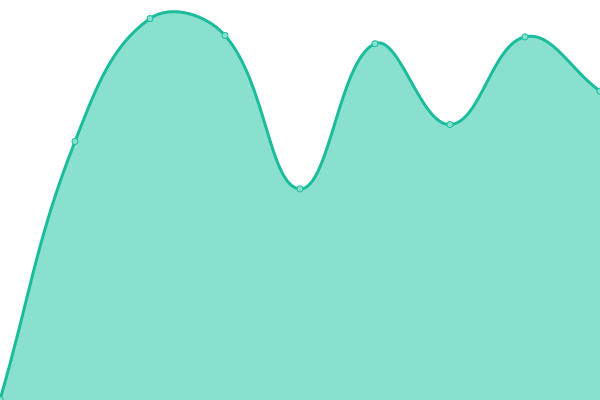
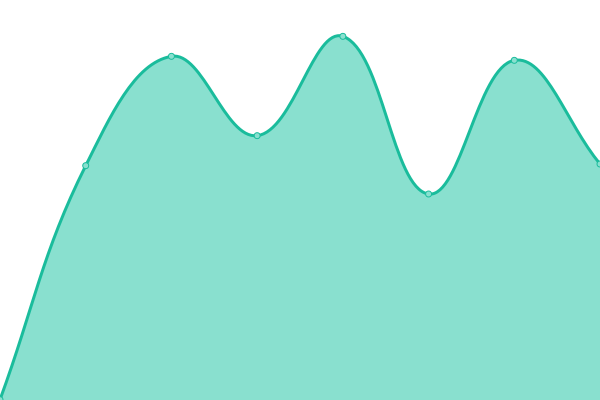
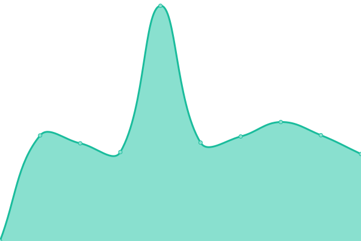
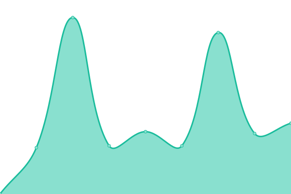
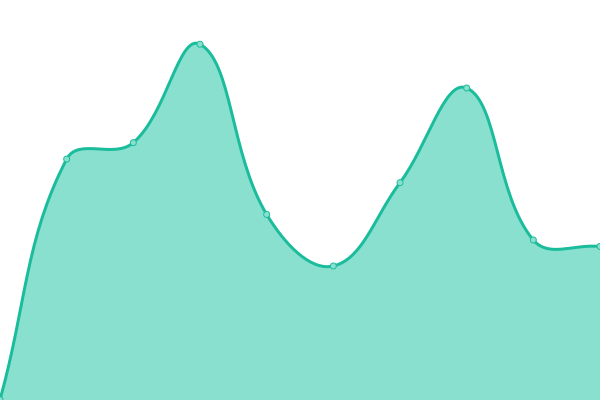
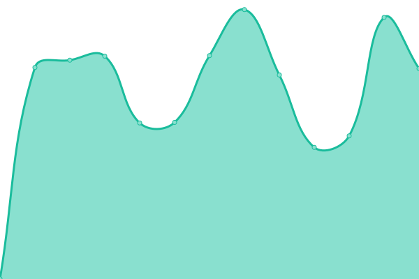
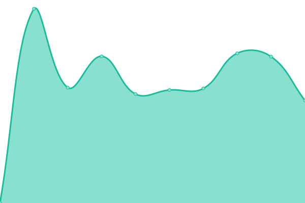
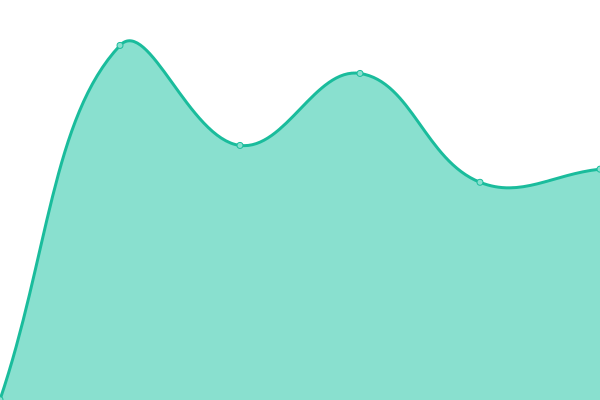

# [📈 Live Status](https://status.linc.nl): <!--live status--> **🟧 Partial outage**

This repository contains the open-source uptime monitor and status page for [LiNC](https://linc.nl), powered by [Upptime](https://github.com/upptime/upptime).

With [Upptime](https://upptime.js.org), you can get your own unlimited and free uptime monitor and status page, powered entirely by a GitHub repository. We use [Issues](https://github.com/lincgit/linc-uptime-monitor/issues) as incident reports, [Actions](https://github.com/lincgit/linc-uptime-monitor/actions) as uptime monitors, and [Pages](https://status.linc.nl) for the status page.

<!--start: status pages-->
<!-- This summary is generated by Upptime (https://github.com/upptime/upptime) -->
<!-- Do not edit this manually, your changes will be overwritten -->
<!-- prettier-ignore -->
| URL | Status | History | Response Time | Uptime |
| --- | ------ | ------- | ------------- | ------ |
|  [adhulst.nl](https://adhulst.nl) | 🟩 Up | [adhulst-nl.yml](https://github.com/lincgit/linc-uptime-monitor/commits/HEAD/history/adhulst-nl.yml) | 

 1099ms
     
 | 

<a href="https://status.linc.nl/history/adhulst-nl">96.99%</a>
    

|  [alltape.eu](https://alltape.eu) | 🟩 Up | [alltape-eu.yml](https://github.com/lincgit/linc-uptime-monitor/commits/HEAD/history/alltape-eu.yml) | 

 904ms
     
 | 

<a href="https://status.linc.nl/history/alltape-eu">97.02%</a>
    

|  [barrelandboar.nl](https://barrelandboar.nl) | 🟩 Up | [barrelandboar-nl.yml](https://github.com/lincgit/linc-uptime-monitor/commits/HEAD/history/barrelandboar-nl.yml) | 

 1402ms
     
 | 

<a href="https://status.linc.nl/history/barrelandboar-nl">97.04%</a>
    

|  [bedding-concepts.nl](https://bedding-concepts.nl) | 🟩 Up | [bedding-concepts-nl.yml](https://github.com/lincgit/linc-uptime-monitor/commits/HEAD/history/bedding-concepts-nl.yml) | 

 866ms
     
 | 

<a href="https://status.linc.nl/history/bedding-concepts-nl">97.07%</a>
    

|  [bioammo.nl](https://bioammo.nl) | 🟩 Up | [bioammo-nl.yml](https://github.com/lincgit/linc-uptime-monitor/commits/HEAD/history/bioammo-nl.yml) | 

 1303ms
     
 | 

<a href="https://status.linc.nl/history/bioammo-nl">97.09%</a>
    

|  [bisley.nl](https://bisley.nl) | 🟩 Up | [bisley-nl.yml](https://github.com/lincgit/linc-uptime-monitor/commits/HEAD/history/bisley-nl.yml) | 

 1174ms
     
 | 

<a href="https://status.linc.nl/history/bisley-nl">97.11%</a>
    

|  [boardingfestival.com](https://boardingfestival.com) | 🟩 Up | [boardingfestival-com.yml](https://github.com/lincgit/linc-uptime-monitor/commits/HEAD/history/boardingfestival-com.yml) | 

 1053ms
     
 | 

<a href="https://status.linc.nl/history/boardingfestival-com">97.14%</a>
    

|  [cafeaula.nl](https://cafeaula.nl) | 🟩 Up | [cafeaula-nl.yml](https://github.com/lincgit/linc-uptime-monitor/commits/HEAD/history/cafeaula-nl.yml) | 

 936ms
     
 | 

<a href="https://status.linc.nl/history/cafeaula-nl">97.16%</a>
    

|  [charterama.com](https://charterama.com) | 🟩 Up | [charterama-com.yml](https://github.com/lincgit/linc-uptime-monitor/commits/HEAD/history/charterama-com.yml) | 

 1408ms
     
 | 

<a href="https://status.linc.nl/history/charterama-com">97.19%</a>
    

|  [con-questa.com](https://con-questa.com) | 🟩 Up | [con-questa-com.yml](https://github.com/lincgit/linc-uptime-monitor/commits/HEAD/history/con-questa-com.yml) | 

 1107ms
     
 | 

<a href="https://status.linc.nl/history/con-questa-com">97.21%</a>
    

|  [creativefamily.nl](https://creativefamily.nl) | 🟥 Down | [creativefamily-nl.yml](https://github.com/lincgit/linc-uptime-monitor/commits/HEAD/history/creativefamily-nl.yml) | 

 918ms
     
 | 

<a href="https://status.linc.nl/history/creativefamily-nl">97.22%</a>
    

|  [defender-boxes.com](https://defender-boxes.com) | 🟩 Up | [defender-boxes-com.yml](https://github.com/lincgit/linc-uptime-monitor/commits/HEAD/history/defender-boxes-com.yml) | 

 1027ms
     
 | 

<a href="https://status.linc.nl/history/defender-boxes-com">97.26%</a>
    

|  [dehorstgoes.nl](https://dehorstgoes.nl) | 🟩 Up | [dehorstgoes-nl.yml](https://github.com/lincgit/linc-uptime-monitor/commits/HEAD/history/dehorstgoes-nl.yml) | 

 725ms
     
 | 

<a href="https://status.linc.nl/history/dehorstgoes-nl">97.28%</a>
    

|  [deprovinciekiest.nl](https://deprovinciekiest.nl) | 🟩 Up | [deprovinciekiest-nl.yml](https://github.com/lincgit/linc-uptime-monitor/commits/HEAD/history/deprovinciekiest-nl.yml) | 

 1435ms
     
 | 

<a href="https://status.linc.nl/history/deprovinciekiest-nl">97.31%</a>
    

|  [deschakelgoes.nl](https://deschakelgoes.nl) | 🟩 Up | [deschakelgoes-nl.yml](https://github.com/lincgit/linc-uptime-monitor/commits/HEAD/history/deschakelgoes-nl.yml) | 

 854ms
     
 | 

<a href="https://status.linc.nl/history/deschakelgoes-nl">97.33%</a>
    

|  [detail4retail.nl](https://detail4retail.nl) | 🟩 Up | [detail4retail-nl.yml](https://github.com/lincgit/linc-uptime-monitor/commits/HEAD/history/detail4retail-nl.yml) | 

 2250ms
     
 | 

<a href="https://status.linc.nl/history/detail4retail-nl">97.36%</a>
    

|  [easypiezie.nl](https://easypiezie.nl) | 🟩 Up | [easypiezie-nl.yml](https://github.com/lincgit/linc-uptime-monitor/commits/HEAD/history/easypiezie-nl.yml) | 

 1571ms
     
 | 

<a href="https://status.linc.nl/history/easypiezie-nl">97.38%</a>
    

|  [enlarg3d.nl](https://enlarg3d.nl) | 🟩 Up | [enlarg3d-nl.yml](https://github.com/lincgit/linc-uptime-monitor/commits/HEAD/history/enlarg3d-nl.yml) | 

 1163ms
     
 | 

<a href="https://status.linc.nl/history/enlarg3d-nl">97.40%</a>
    

|  [etagon.nl](https://etagon.nl) | 🟩 Up | [etagon-nl.yml](https://github.com/lincgit/linc-uptime-monitor/commits/HEAD/history/etagon-nl.yml) | 

 1734ms
     
 | 

<a href="https://status.linc.nl/history/etagon-nl">97.43%</a>
    

|  [faes-packaging-solutions.com](https://faes-packaging-solutions.com) | 🟩 Up | [faes-packaging-solutions-com.yml](https://github.com/lincgit/linc-uptime-monitor/commits/HEAD/history/faes-packaging-solutions-com.yml) | 

 1755ms
     
 | 

<a href="https://status.linc.nl/history/faes-packaging-solutions-com">97.45%</a>
    

|  [fuchs-wse.nl](https://fuchs-wse.nl) | 🟩 Up | [fuchs-wse-nl.yml](https://github.com/lincgit/linc-uptime-monitor/commits/HEAD/history/fuchs-wse-nl.yml) | 

 887ms
     
 | 

<a href="https://status.linc.nl/history/fuchs-wse-nl">97.48%</a>
    

|  [getaheadineurope.com](https://getaheadineurope.com) | 🟩 Up | [getaheadineurope-com.yml](https://github.com/lincgit/linc-uptime-monitor/commits/HEAD/history/getaheadineurope-com.yml) | 

 1074ms
     
 | 

<a href="https://status.linc.nl/history/getaheadineurope-com">97.50%</a>
    

|  [glatzonline.nl](https://glatzonline.nl) | 🟩 Up | [glatzonline-nl.yml](https://github.com/lincgit/linc-uptime-monitor/commits/HEAD/history/glatzonline-nl.yml) | 

 791ms
     
 | 

<a href="https://status.linc.nl/history/glatzonline-nl">97.52%</a>
    

|  [gocompany.nl](https://gocompany.nl) | 🟩 Up | [gocompany-nl.yml](https://github.com/lincgit/linc-uptime-monitor/commits/HEAD/history/gocompany-nl.yml) | 

 1133ms
     
 | 

<a href="https://status.linc.nl/history/gocompany-nl">97.55%</a>
    

|  [greeniuz.nl](https://greeniuz.nl) | 🟩 Up | [greeniuz-nl.yml](https://github.com/lincgit/linc-uptime-monitor/commits/HEAD/history/greeniuz-nl.yml) | 

 1035ms
     
 | 

<a href="https://status.linc.nl/history/greeniuz-nl">97.57%</a>
    

|  [hollandpackaging.nl](https://hollandpackaging.nl) | 🟩 Up | [hollandpackaging-nl.yml](https://github.com/lincgit/linc-uptime-monitor/commits/HEAD/history/hollandpackaging-nl.yml) | 

 1053ms
     
 | 

<a href="https://status.linc.nl/history/hollandpackaging-nl">97.60%</a>
    

|  [hydratechbenelux.nl](https://hydratechbenelux.nl) | 🟩 Up | [hydratechbenelux-nl.yml](https://github.com/lincgit/linc-uptime-monitor/commits/HEAD/history/hydratechbenelux-nl.yml) | 

 1501ms
     
 | 

<a href="https://status.linc.nl/history/hydratechbenelux-nl">97.62%</a>
    

|  [infocvb.nl](https://infocvb.nl) | 🟩 Up | [infocvb-nl.yml](https://github.com/lincgit/linc-uptime-monitor/commits/HEAD/history/infocvb-nl.yml) | 

 874ms
     
 | 

<a href="https://status.linc.nl/history/infocvb-nl">97.64%</a>
    

|  [inglasco-int.com](https://inglasco-int.com) | 🟩 Up | [inglasco-int-com.yml](https://github.com/lincgit/linc-uptime-monitor/commits/HEAD/history/inglasco-int-com.yml) | 

 1014ms
     
 | 

<a href="https://status.linc.nl/history/inglasco-int-com">97.67%</a>
    

|  [inglasco.nl](https://inglasco.nl) | 🟩 Up | [inglasco-nl.yml](https://github.com/lincgit/linc-uptime-monitor/commits/HEAD/history/inglasco-nl.yml) | 

 852ms
     
 | 

<a href="https://status.linc.nl/history/inglasco-nl">97.69%</a>
    

|  [innoseal.shop](https://innoseal.shop) | 🟩 Up | [innoseal-shop.yml](https://github.com/lincgit/linc-uptime-monitor/commits/HEAD/history/innoseal-shop.yml) | 

 1129ms
     
 | 

<a href="https://status.linc.nl/history/innoseal-shop">97.72%</a>
    

|  [intranet.wspmiddenbrabant.nl](https://intranet.wspmiddenbrabant.nl) | 🟩 Up | [intranet-wspmiddenbrabant-nl.yml](https://github.com/lincgit/linc-uptime-monitor/commits/HEAD/history/intranet-wspmiddenbrabant-nl.yml) | 

 3542ms
     
 | 

<a href="https://status.linc.nl/history/intranet-wspmiddenbrabant-nl">100.00%</a>
    

|  [jcmeijers.com](https://jcmeijers.com) | 🟩 Up | [jcmeijers-com.yml](https://github.com/lincgit/linc-uptime-monitor/commits/HEAD/history/jcmeijers-com.yml) | 

 871ms
     
 | 

<a href="https://status.linc.nl/history/jcmeijers-com">97.74%</a>
    

|  [kootstrarijopleidingen.nl](https://kootstrarijopleidingen.nl) | 🟩 Up | [kootstrarijopleidingen-nl.yml](https://github.com/lincgit/linc-uptime-monitor/commits/HEAD/history/kootstrarijopleidingen-nl.yml) | 

 851ms
     
 | 

<a href="https://status.linc.nl/history/kootstrarijopleidingen-nl">97.77%</a>
    

|  [kristelsfashion.nl](https://kristelsfashion.nl) | 🟩 Up | [kristelsfashion-nl.yml](https://github.com/lincgit/linc-uptime-monitor/commits/HEAD/history/kristelsfashion-nl.yml) | 

 730ms
     
 | 

<a href="https://status.linc.nl/history/kristelsfashion-nl">98.10%</a>
    

|  [lan-intranet.nl](https://lan-intranet.nl) | 🟩 Up | [lan-intranet-nl.yml](https://github.com/lincgit/linc-uptime-monitor/commits/HEAD/history/lan-intranet-nl.yml) | 

 1403ms
     
 | 

<a href="https://status.linc.nl/history/lan-intranet-nl">97.81%</a>
    

|  [lanhandling.com](https://lanhandling.com) | 🟩 Up | [lanhandling-com.yml](https://github.com/lincgit/linc-uptime-monitor/commits/HEAD/history/lanhandling-com.yml) | 

 1125ms
     
 | 

<a href="https://status.linc.nl/history/lanhandling-com">97.84%</a>
    

|  [lekker-brabant.nl](https://lekker-brabant.nl) | 🟩 Up | [lekker-brabant-nl.yml](https://github.com/lincgit/linc-uptime-monitor/commits/HEAD/history/lekker-brabant-nl.yml) | 

 1395ms
     
 | 

<a href="https://status.linc.nl/history/lekker-brabant-nl">97.86%</a>
    

|  [libretica.nl](https://libretica.nl) | 🟩 Up | [libretica-nl.yml](https://github.com/lincgit/linc-uptime-monitor/commits/HEAD/history/libretica-nl.yml) | 

 803ms
     
 | 

<a href="https://status.linc.nl/history/libretica-nl">97.89%</a>
    

|  [linc.nl](https://linc.nl) | 🟩 Up | [linc-nl.yml](https://github.com/lincgit/linc-uptime-monitor/commits/HEAD/history/linc-nl.yml) | 

 993ms
     
 | 

<a href="https://status.linc.nl/history/linc-nl">97.91%</a>
    

|  [magna-capital-partners.com](https://magna-capital-partners.com) | 🟩 Up | [magna-capital-partners-com.yml](https://github.com/lincgit/linc-uptime-monitor/commits/HEAD/history/magna-capital-partners-com.yml) | 

 1183ms
     
 | 

<a href="https://status.linc.nl/history/magna-capital-partners-com">97.94%</a>
    

|  [marcom-inhouse.nl](https://marcom-inhouse.nl) | 🟩 Up | [marcom-inhouse-nl.yml](https://github.com/lincgit/linc-uptime-monitor/commits/HEAD/history/marcom-inhouse-nl.yml) | 

 781ms
     
 | 

<a href="https://status.linc.nl/history/marcom-inhouse-nl">97.96%</a>
    

|  [marquardt-kuchen.nl](https://marquardt-kuchen.nl) | 🟩 Up | [marquardt-kuchen-nl.yml](https://github.com/lincgit/linc-uptime-monitor/commits/HEAD/history/marquardt-kuchen-nl.yml) | 

 1083ms
     
 | 

<a href="https://status.linc.nl/history/marquardt-kuchen-nl">97.99%</a>
    

|  [mensgerichteouderenzorg.nl](https://mensgerichteouderenzorg.nl) | 🟩 Up | [mensgerichteouderenzorg-nl.yml](https://github.com/lincgit/linc-uptime-monitor/commits/HEAD/history/mensgerichteouderenzorg-nl.yml) | 

 877ms
     
 | 

<a href="https://status.linc.nl/history/mensgerichteouderenzorg-nl">98.01%</a>
    

|  [mondzorgbaliendijk.nl](https://mondzorgbaliendijk.nl) | 🟩 Up | [mondzorgbaliendijk-nl.yml](https://github.com/lincgit/linc-uptime-monitor/commits/HEAD/history/mondzorgbaliendijk-nl.yml) | 

 1227ms
     
 | 

<a href="https://status.linc.nl/history/mondzorgbaliendijk-nl">98.04%</a>
    

|  [move.scheepens.nl](https://move.scheepens.nl) | 🟩 Up | [move-scheepens-nl.yml](https://github.com/lincgit/linc-uptime-monitor/commits/HEAD/history/move-scheepens-nl.yml) | 

 982ms
     
 | 

<a href="https://status.linc.nl/history/move-scheepens-nl">98.06%</a>
    

|  [newbridges.nl](https://newbridges.nl) | 🟩 Up | [newbridges-nl.yml](https://github.com/lincgit/linc-uptime-monitor/commits/HEAD/history/newbridges-nl.yml) | 

 1086ms
     
 | 

<a href="https://status.linc.nl/history/newbridges-nl">98.08%</a>
    

|  [nextadvocaten.nl](https://nextadvocaten.nl) | 🟩 Up | [nextadvocaten-nl.yml](https://github.com/lincgit/linc-uptime-monitor/commits/HEAD/history/nextadvocaten-nl.yml) | 

 784ms
     
 | 

<a href="https://status.linc.nl/history/nextadvocaten-nl">98.11%</a>
    

|  [nvp-unima.nl](https://nvp-unima.nl) | 🟩 Up | [nvp-unima-nl.yml](https://github.com/lincgit/linc-uptime-monitor/commits/HEAD/history/nvp-unima-nl.yml) | 

 1673ms
     
 | 

<a href="https://status.linc.nl/history/nvp-unima-nl">98.13%</a>
    

|  [olympushillegersberg.nl](https://olympushillegersberg.nl) | 🟩 Up | [olympushillegersberg-nl.yml](https://github.com/lincgit/linc-uptime-monitor/commits/HEAD/history/olympushillegersberg-nl.yml) | 

 676ms
     
 | 

<a href="https://status.linc.nl/history/olympushillegersberg-nl">98.16%</a>
    

|  [outings.nl](https://outings.nl) | 🟩 Up | [outings-nl.yml](https://github.com/lincgit/linc-uptime-monitor/commits/HEAD/history/outings-nl.yml) | 

 1162ms
     
 | 

<a href="https://status.linc.nl/history/outings-nl">98.18%</a>
    

|  [pontex-ip.nl](https://pontex-ip.nl) | 🟩 Up | [pontex-ip-nl.yml](https://github.com/lincgit/linc-uptime-monitor/commits/HEAD/history/pontex-ip-nl.yml) | 

 1053ms
     
 | 

<a href="https://status.linc.nl/history/pontex-ip-nl">98.21%</a>
    

|  [skb-europe.com](https://skb-europe.com) | 🟩 Up | [skb-europe-com.yml](https://github.com/lincgit/linc-uptime-monitor/commits/HEAD/history/skb-europe-com.yml) | 

 1013ms
     
 | 

<a href="https://status.linc.nl/history/skb-europe-com">98.23%</a>
    

|  [specialolympics2024.nl](https://specialolympics2024.nl) | 🟩 Up | [specialolympics2024-nl.yml](https://github.com/lincgit/linc-uptime-monitor/commits/HEAD/history/specialolympics2024-nl.yml) | 

 1032ms
     
 | 

<a href="https://status.linc.nl/history/specialolympics2024-nl">98.26%</a>
    

|  [studio-tegenlicht.nl](https://studio-tegenlicht.nl) | 🟩 Up | [studio-tegenlicht-nl.yml](https://github.com/lincgit/linc-uptime-monitor/commits/HEAD/history/studio-tegenlicht-nl.yml) | 

 1289ms
     
 | 

<a href="https://status.linc.nl/history/studio-tegenlicht-nl">98.28%</a>
    

|  [swinhovegroep.nl](https://swinhovegroep.nl) | 🟩 Up | [swinhovegroep-nl.yml](https://github.com/lincgit/linc-uptime-monitor/commits/HEAD/history/swinhovegroep-nl.yml) | 

 875ms
     
 | 

<a href="https://status.linc.nl/history/swinhovegroep-nl">98.30%</a>
    

|  [thepostoffice013.nl](https://thepostoffice013.nl) | 🟩 Up | [thepostoffice013-nl.yml](https://github.com/lincgit/linc-uptime-monitor/commits/HEAD/history/thepostoffice013-nl.yml) | 

 1080ms
     
 | 

<a href="https://status.linc.nl/history/thepostoffice013-nl">98.33%</a>
    

|  [vandaagvoorlater.nl](https://vandaagvoorlater.nl) | 🟩 Up | [vandaagvoorlater-nl.yml](https://github.com/lincgit/linc-uptime-monitor/commits/HEAD/history/vandaagvoorlater-nl.yml) | 

 924ms
     
 | 

<a href="https://status.linc.nl/history/vandaagvoorlater-nl">98.35%</a>
    

|  [vdsprojects.nl](https://vdsprojects.nl) | 🟩 Up | [vdsprojects-nl.yml](https://github.com/lincgit/linc-uptime-monitor/commits/HEAD/history/vdsprojects-nl.yml) | 

 1465ms
     
 | 

<a href="https://status.linc.nl/history/vdsprojects-nl">98.38%</a>
    

|  [vekon.nl](https://vekon.nl) | 🟩 Up | [vekon-nl.yml](https://github.com/lincgit/linc-uptime-monitor/commits/HEAD/history/vekon-nl.yml) | 

 1479ms
     
 | 

<a href="https://status.linc.nl/history/vekon-nl">98.55%</a>
    

|  [vhex.nl](https://vhex.nl) | 🟩 Up | [vhex-nl.yml](https://github.com/lincgit/linc-uptime-monitor/commits/HEAD/history/vhex-nl.yml) | 

 803ms
     
 | 

<a href="https://status.linc.nl/history/vhex-nl">98.57%</a>
    

|  [viking-boxes.com](https://viking-boxes.com) | 🟩 Up | [viking-boxes-com.yml](https://github.com/lincgit/linc-uptime-monitor/commits/HEAD/history/viking-boxes-com.yml) | 

 1044ms
     
 | 

<a href="https://status.linc.nl/history/viking-boxes-com">98.59%</a>
    

|  [vivar.nl](https://vivar.nl) | 🟩 Up | [vivar-nl.yml](https://github.com/lincgit/linc-uptime-monitor/commits/HEAD/history/vivar-nl.yml) | 

 848ms
     
 | 

<a href="https://status.linc.nl/history/vivar-nl">98.61%</a>
    

|  [vivarforwarding.nl](https://vivarforwarding.nl) | 🟩 Up | [vivarforwarding-nl.yml](https://github.com/lincgit/linc-uptime-monitor/commits/HEAD/history/vivarforwarding-nl.yml) | 

 930ms
     
 | 

<a href="https://status.linc.nl/history/vivarforwarding-nl">98.63%</a>
    

|  [vn-plu.com](https://vn-plu.com) | 🟩 Up | [vn-plu-com.yml](https://github.com/lincgit/linc-uptime-monitor/commits/HEAD/history/vn-plu-com.yml) | 

 821ms
     
 | 

<a href="https://status.linc.nl/history/vn-plu-com">98.65%</a>
    

|  [werkenbij.vlc-partners.nl](https://werkenbij.vlc-partners.nl) | 🟩 Up | [werkenbij-vlc-partners-nl.yml](https://github.com/lincgit/linc-uptime-monitor/commits/HEAD/history/werkenbij-vlc-partners-nl.yml) | 

 2454ms
     
 | 

<a href="https://status.linc.nl/history/werkenbij-vlc-partners-nl">98.66%</a>
    

|  [werkenbijswinhove.nl](https://werkenbijswinhove.nl) | 🟩 Up | [werkenbijswinhove-nl.yml](https://github.com/lincgit/linc-uptime-monitor/commits/HEAD/history/werkenbijswinhove-nl.yml) | 

 1408ms
     
 | 

<a href="https://status.linc.nl/history/werkenbijswinhove-nl">98.68%</a>
    

|  [win-rs.nl](https://win-rs.nl) | 🟩 Up | [win-rs-nl.yml](https://github.com/lincgit/linc-uptime-monitor/commits/HEAD/history/win-rs-nl.yml) | 

 1383ms
     
 | 

<a href="https://status.linc.nl/history/win-rs-nl">98.70%</a>
    

|  [wolterwolthers.nl](https://wolterwolthers.nl) | 🟩 Up | [wolterwolthers-nl.yml](https://github.com/lincgit/linc-uptime-monitor/commits/HEAD/history/wolterwolthers-nl.yml) | 

 943ms
     
 | 

<a href="https://status.linc.nl/history/wolterwolthers-nl">98.87%</a>
    

|  [wonenbijdefamilie.nl](https://wonenbijdefamilie.nl) | 🟩 Up | [wonenbijdefamilie-nl.yml](https://github.com/lincgit/linc-uptime-monitor/commits/HEAD/history/wonenbijdefamilie-nl.yml) | 

 820ms
     
 | 

<a href="https://status.linc.nl/history/wonenbijdefamilie-nl">98.88%</a>
    

|  [wsphelmond-depeel.nl](https://wsphelmond-depeel.nl) | 🟩 Up | [wsphelmond-depeel-nl.yml](https://github.com/lincgit/linc-uptime-monitor/commits/HEAD/history/wsphelmond-depeel-nl.yml) | 

 1147ms
     
 | 

<a href="https://status.linc.nl/history/wsphelmond-depeel-nl">98.90%</a>
    

|  [yourvolvo.nl](https://yourvolvo.nl) | 🟩 Up | [yourvolvo-nl.yml](https://github.com/lincgit/linc-uptime-monitor/commits/HEAD/history/yourvolvo-nl.yml) | 

 706ms
     
 | 

<a href="https://status.linc.nl/history/yourvolvo-nl">98.91%</a>
    

<!--end: status pages-->

[**Visit our status website →**](https://status.linc.nl)

## 📄 License

- Powered by: [Upptime](https://github.com/upptime/upptime)
- Code: [MIT](./LICENSE) © [LiNC](https://linc.nl)
- Data in the `./history` directory: [Open Database License](https://opendatacommons.org/licenses/odbl/1-0/)
