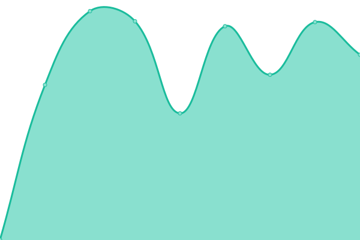
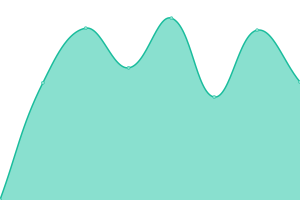
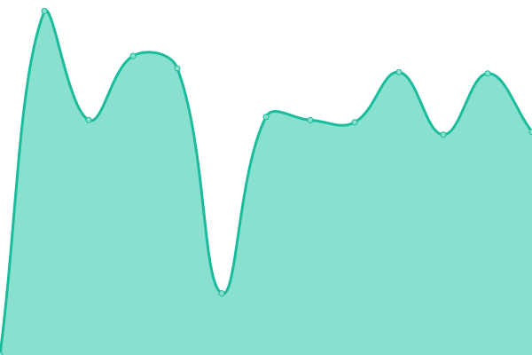
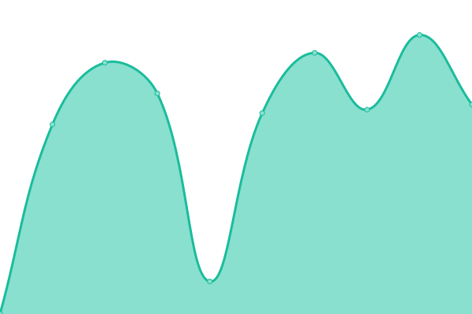
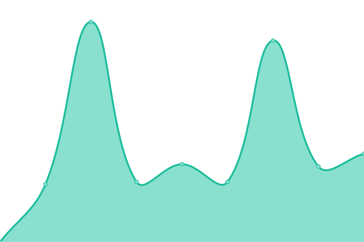
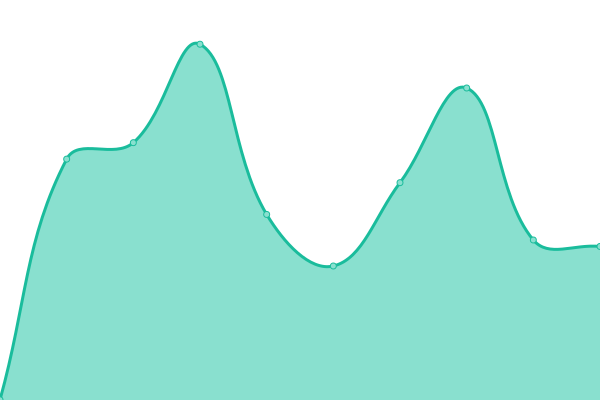
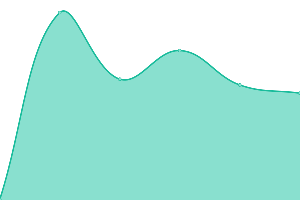
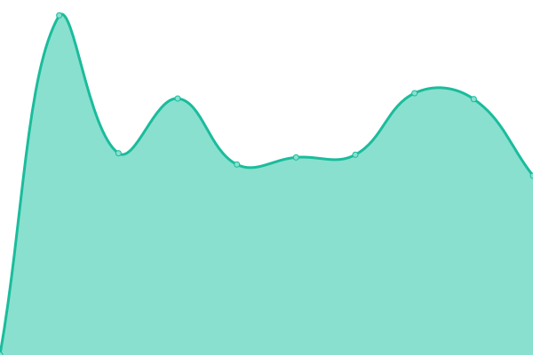
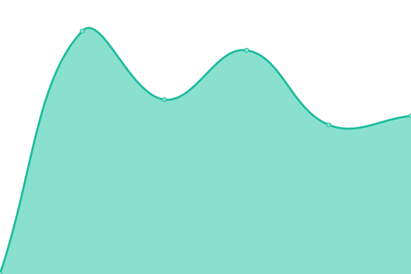

# [📈 Live Status](https://lincgit.github.io/uptime-monitor): <!--live status--> **🟧 Partial outage**

This repository contains the open-source uptime monitor and status page for [LiNC](https://linc.nl), powered by [Upptime](https://github.com/upptime/upptime).

With [Upptime](https://upptime.js.org), you can get your own unlimited and free uptime monitor and status page, powered entirely by a GitHub repository. We use [Issues](https://github.com/lincgit/uptime-monitor/issues) as incident reports, [Actions](https://github.com/lincgit/uptime-monitor/actions) as uptime monitors, and [Pages](https://lincgit.github.io/uptime-monitor) for the status page.

<!--start: status pages-->
<!-- This summary is generated by Upptime (https://github.com/upptime/upptime) -->
<!-- Do not edit this manually, your changes will be overwritten -->
<!-- prettier-ignore -->
| URL | Status | History | Response Time | Uptime |
| --- | ------ | ------- | ------------- | ------ |
|  [adhulst.nl](https://adhulst.nl) | 🟩 Up | [adhulst-nl.yml](https://github.com/lincgit/linc-uptime-monitor/commits/HEAD/history/adhulst-nl.yml) | 

 2419ms
     
 | 

<a href="https://status.linc.nl/history/adhulst-nl">59.41%</a>
    

|  [alltape.eu](https://alltape.eu) | 🟩 Up | [alltape-eu.yml](https://github.com/lincgit/linc-uptime-monitor/commits/HEAD/history/alltape-eu.yml) | 

 977ms
     
 | 

<a href="https://status.linc.nl/history/alltape-eu">59.42%</a>
    

|  [bedding-concepts.nl](https://bedding-concepts.nl) | 🟩 Up | [bedding-concepts-nl.yml](https://github.com/lincgit/linc-uptime-monitor/commits/HEAD/history/bedding-concepts-nl.yml) | 

 798ms
     
 | 

<a href="https://status.linc.nl/history/bedding-concepts-nl">59.42%</a>
    

|  [bioammo.nl](https://bioammo.nl) | 🟩 Up | [bioammo-nl.yml](https://github.com/lincgit/linc-uptime-monitor/commits/HEAD/history/bioammo-nl.yml) | 

 1175ms
     
 | 

<a href="https://status.linc.nl/history/bioammo-nl">61.89%</a>
    

|  [bisley.nl](https://bisley.nl) | 🟩 Up | [bisley-nl.yml](https://github.com/lincgit/linc-uptime-monitor/commits/HEAD/history/bisley-nl.yml) | 

 868ms
     
 | 

<a href="https://status.linc.nl/history/bisley-nl">100.00%</a>
    

|  [boardingfestival.com](https://boardingfestival.com) | 🟩 Up | [boardingfestival-com.yml](https://github.com/lincgit/linc-uptime-monitor/commits/HEAD/history/boardingfestival-com.yml) | 

 1011ms
     
 | 

<a href="https://status.linc.nl/history/boardingfestival-com">59.43%</a>
    

|  [cafeaula.nl](https://cafeaula.nl) | 🟩 Up | [cafeaula-nl.yml](https://github.com/lincgit/linc-uptime-monitor/commits/HEAD/history/cafeaula-nl.yml) | 

 985ms
     
 | 

<a href="https://status.linc.nl/history/cafeaula-nl">100.00%</a>
    

|  [charterama.com](https://charterama.com) | 🟩 Up | [charterama-com.yml](https://github.com/lincgit/linc-uptime-monitor/commits/HEAD/history/charterama-com.yml) | 

 2254ms
     
 | 

<a href="https://status.linc.nl/history/charterama-com">59.44%</a>
    

|  [con-questa.com](https://con-questa.com) | 🟩 Up | [con-questa-com.yml](https://github.com/lincgit/linc-uptime-monitor/commits/HEAD/history/con-questa-com.yml) | 

 985ms
     
 | 

<a href="https://status.linc.nl/history/con-questa-com">98.92%</a>
    

|  [creativefamily.nl](https://creativefamily.nl) | 🟩 Up | [creativefamily-nl.yml](https://github.com/lincgit/linc-uptime-monitor/commits/HEAD/history/creativefamily-nl.yml) | 

 802ms
     
 | 

<a href="https://status.linc.nl/history/creativefamily-nl">59.45%</a>
    

|  [dementiespecialist.nl](https://dementiespecialist.nl) | 🟩 Up | [dementiespecialist-nl.yml](https://github.com/lincgit/linc-uptime-monitor/commits/HEAD/history/dementiespecialist-nl.yml) | 

 1314ms
     
 | 

<a href="https://status.linc.nl/history/dementiespecialist-nl">100.00%</a>
    

|  [deprovinciekiest.nl](https://deprovinciekiest.nl) | 🟩 Up | [deprovinciekiest-nl.yml](https://github.com/lincgit/linc-uptime-monitor/commits/HEAD/history/deprovinciekiest-nl.yml) | 

 1999ms
     
 | 

<a href="https://status.linc.nl/history/deprovinciekiest-nl">98.94%</a>
    

|  [deschakelgoes.nl](https://deschakelgoes.nl) | 🟩 Up | [deschakelgoes-nl.yml](https://github.com/lincgit/linc-uptime-monitor/commits/HEAD/history/deschakelgoes-nl.yml) | 

 909ms
     
 | 

<a href="https://status.linc.nl/history/deschakelgoes-nl">99.76%</a>
    

|  [easypiezie.nl](https://easypiezie.nl) | 🟩 Up | [easypiezie-nl.yml](https://github.com/lincgit/linc-uptime-monitor/commits/HEAD/history/easypiezie-nl.yml) | 

 836ms
     
 | 

<a href="https://status.linc.nl/history/easypiezie-nl">99.88%</a>
    

|  [enlarg3d.nl](https://enlarg3d.nl) | 🟩 Up | [enlarg3d-nl.yml](https://github.com/lincgit/linc-uptime-monitor/commits/HEAD/history/enlarg3d-nl.yml) | 

 852ms
     
 | 

<a href="https://status.linc.nl/history/enlarg3d-nl">100.00%</a>
    

|  [etagon.nl](https://etagon.nl) | 🟩 Up | [etagon-nl.yml](https://github.com/lincgit/linc-uptime-monitor/commits/HEAD/history/etagon-nl.yml) | 

 1643ms
     
 | 

<a href="https://status.linc.nl/history/etagon-nl">98.96%</a>
    

|  [fuchs-wse.nl](https://fuchs-wse.nl) | 🟩 Up | [fuchs-wse-nl.yml](https://github.com/lincgit/linc-uptime-monitor/commits/HEAD/history/fuchs-wse-nl.yml) | 

 888ms
     
 | 

<a href="https://status.linc.nl/history/fuchs-wse-nl">98.97%</a>
    

|  [glatzonline.nl](https://glatzonline.nl) | 🟩 Up | [glatzonline-nl.yml](https://github.com/lincgit/linc-uptime-monitor/commits/HEAD/history/glatzonline-nl.yml) | 

 929ms
     
 | 

<a href="https://status.linc.nl/history/glatzonline-nl">100.00%</a>
    

|  [gocompany.nl](https://gocompany.nl) | 🟩 Up | [gocompany-nl.yml](https://github.com/lincgit/linc-uptime-monitor/commits/HEAD/history/gocompany-nl.yml) | 

 1066ms
     
 | 

<a href="https://status.linc.nl/history/gocompany-nl">100.00%</a>
    

|  [greeniuz.nl](https://greeniuz.nl) | 🟩 Up | [greeniuz-nl.yml](https://github.com/lincgit/linc-uptime-monitor/commits/HEAD/history/greeniuz-nl.yml) | 

 1129ms
     
 | 

<a href="https://status.linc.nl/history/greeniuz-nl">100.00%</a>
    

|  [hgm.eu](https://hgm.eu) | 🟩 Up | [hgm-eu.yml](https://github.com/lincgit/linc-uptime-monitor/commits/HEAD/history/hgm-eu.yml) | 

 2887ms
     
 | 

<a href="https://status.linc.nl/history/hgm-eu">59.47%</a>
    

|  [hollandpackaging.nl](https://hollandpackaging.nl) | 🟩 Up | [hollandpackaging-nl.yml](https://github.com/lincgit/linc-uptime-monitor/commits/HEAD/history/hollandpackaging-nl.yml) | 

 2264ms
     
 | 

<a href="https://status.linc.nl/history/hollandpackaging-nl">100.00%</a>
    

|  [hydratechbenelux.nl](https://hydratechbenelux.nl) | 🟩 Up | [hydratechbenelux-nl.yml](https://github.com/lincgit/linc-uptime-monitor/commits/HEAD/history/hydratechbenelux-nl.yml) | 

 718ms
     
 | 

<a href="https://status.linc.nl/history/hydratechbenelux-nl">100.00%</a>
    

|  [infocvb.nl](https://infocvb.nl) | 🟩 Up | [infocvb-nl.yml](https://github.com/lincgit/linc-uptime-monitor/commits/HEAD/history/infocvb-nl.yml) | 

 1625ms
     
 | 

<a href="https://status.linc.nl/history/infocvb-nl">100.00%</a>
    

|  [inglasco-int.com](https://inglasco-int.com) | 🟩 Up | [inglasco-int-com.yml](https://github.com/lincgit/linc-uptime-monitor/commits/HEAD/history/inglasco-int-com.yml) | 

 989ms
     
 | 

<a href="https://status.linc.nl/history/inglasco-int-com">100.00%</a>
    

|  [inglasco.nl](https://inglasco.nl) | 🟩 Up | [inglasco-nl.yml](https://github.com/lincgit/linc-uptime-monitor/commits/HEAD/history/inglasco-nl.yml) | 

 841ms
     
 | 

<a href="https://status.linc.nl/history/inglasco-nl">100.00%</a>
    

|  [innoseal.shop](https://innoseal.shop) | 🟩 Up | [innoseal-shop.yml](https://github.com/lincgit/linc-uptime-monitor/commits/HEAD/history/innoseal-shop.yml) | 

 1031ms
     
 | 

<a href="https://status.linc.nl/history/innoseal-shop">100.00%</a>
    

|  [intranet.wspmiddenbrabant.nl](https://intranet.wspmiddenbrabant.nl) | 🟩 Up | [intranet-wspmiddenbrabant-nl.yml](https://github.com/lincgit/linc-uptime-monitor/commits/HEAD/history/intranet-wspmiddenbrabant-nl.yml) | 

 3155ms
     
 | 

<a href="https://status.linc.nl/history/intranet-wspmiddenbrabant-nl">100.00%</a>
    

|  [jcmeijers.com](https://jcmeijers.com) | 🟩 Up | [jcmeijers-com.yml](https://github.com/lincgit/linc-uptime-monitor/commits/HEAD/history/jcmeijers-com.yml) | 

 744ms
     
 | 

<a href="https://status.linc.nl/history/jcmeijers-com">100.00%</a>
    

|  [koopjeleaseaf.nl](https://koopjeleaseaf.nl) | 🟥 Down | [koopjeleaseaf-nl.yml](https://github.com/lincgit/linc-uptime-monitor/commits/HEAD/history/koopjeleaseaf-nl.yml) | 

 945ms
     
 | 

<a href="https://status.linc.nl/history/koopjeleaseaf-nl">99.98%</a>
    

|  [kootstrarijopleidingen.nl](https://kootstrarijopleidingen.nl) | 🟩 Up | [kootstrarijopleidingen-nl.yml](https://github.com/lincgit/linc-uptime-monitor/commits/HEAD/history/kootstrarijopleidingen-nl.yml) | 

 2074ms
     
 | 

<a href="https://status.linc.nl/history/kootstrarijopleidingen-nl">100.00%</a>
    

|  [kristelsfashion.nl](https://kristelsfashion.nl) | 🟩 Up | [kristelsfashion-nl.yml](https://github.com/lincgit/linc-uptime-monitor/commits/HEAD/history/kristelsfashion-nl.yml) | 

 943ms
     
 | 

<a href="https://status.linc.nl/history/kristelsfashion-nl">100.00%</a>
    

|  [lanhandling.com](https://lanhandling.com) | 🟩 Up | [lanhandling-com.yml](https://github.com/lincgit/linc-uptime-monitor/commits/HEAD/history/lanhandling-com.yml) | 

 999ms
     
 | 

<a href="https://status.linc.nl/history/lanhandling-com">100.00%</a>
    

|  [lekker-brabant.nl](https://lekker-brabant.nl) | 🟩 Up | [lekker-brabant-nl.yml](https://github.com/lincgit/linc-uptime-monitor/commits/HEAD/history/lekker-brabant-nl.yml) | 

 1845ms
     
 | 

<a href="https://status.linc.nl/history/lekker-brabant-nl">100.00%</a>
    

|  [linc.nl](https://linc.nl) | 🟩 Up | [linc-nl.yml](https://github.com/lincgit/linc-uptime-monitor/commits/HEAD/history/linc-nl.yml) | 

 957ms
     
 | 

<a href="https://status.linc.nl/history/linc-nl">100.00%</a>
    

|  [magna-capital-partners.com](https://magna-capital-partners.com) | 🟩 Up | [magna-capital-partners-com.yml](https://github.com/lincgit/linc-uptime-monitor/commits/HEAD/history/magna-capital-partners-com.yml) | 

 948ms
     
 | 

<a href="https://status.linc.nl/history/magna-capital-partners-com">100.00%</a>
    

|  [marcom-inhouse.nl](https://marcom-inhouse.nl) | 🟩 Up | [marcom-inhouse-nl.yml](https://github.com/lincgit/linc-uptime-monitor/commits/HEAD/history/marcom-inhouse-nl.yml) | 

 866ms
     
 | 

<a href="https://status.linc.nl/history/marcom-inhouse-nl">100.00%</a>
    

|  [marquardt-kuchen.nl](https://marquardt-kuchen.nl) | 🟩 Up | [marquardt-kuchen-nl.yml](https://github.com/lincgit/linc-uptime-monitor/commits/HEAD/history/marquardt-kuchen-nl.yml) | 

 961ms
     
 | 

<a href="https://status.linc.nl/history/marquardt-kuchen-nl">100.00%</a>
    

|  [mensgerichteouderenzorg.nl](https://mensgerichteouderenzorg.nl) | 🟩 Up | [mensgerichteouderenzorg-nl.yml](https://github.com/lincgit/linc-uptime-monitor/commits/HEAD/history/mensgerichteouderenzorg-nl.yml) | 

 902ms
     
 | 

<a href="https://status.linc.nl/history/mensgerichteouderenzorg-nl">100.00%</a>
    

|  [mondzorgbaliendijk.nl](https://mondzorgbaliendijk.nl) | 🟩 Up | [mondzorgbaliendijk-nl.yml](https://github.com/lincgit/linc-uptime-monitor/commits/HEAD/history/mondzorgbaliendijk-nl.yml) | 

 2368ms
     
 | 

<a href="https://status.linc.nl/history/mondzorgbaliendijk-nl">100.00%</a>
    

|  [nervecentre.nl](https://nervecentre.nl) | 🟩 Up | [nervecentre-nl.yml](https://github.com/lincgit/linc-uptime-monitor/commits/HEAD/history/nervecentre-nl.yml) | 

 1269ms
     
 | 

<a href="https://status.linc.nl/history/nervecentre-nl">100.00%</a>
    

|  [newbridges.nl](https://newbridges.nl) | 🟩 Up | [newbridges-nl.yml](https://github.com/lincgit/linc-uptime-monitor/commits/HEAD/history/newbridges-nl.yml) | 

 2086ms
     
 | 

<a href="https://status.linc.nl/history/newbridges-nl">100.00%</a>
    

|  [nextadvocaten.nl](https://nextadvocaten.nl) | 🟩 Up | [nextadvocaten-nl.yml](https://github.com/lincgit/linc-uptime-monitor/commits/HEAD/history/nextadvocaten-nl.yml) | 

 1921ms
     
 | 

<a href="https://status.linc.nl/history/nextadvocaten-nl">100.00%</a>
    

|  [nvp-unima.nl](https://nvp-unima.nl) | 🟩 Up | [nvp-unima-nl.yml](https://github.com/lincgit/linc-uptime-monitor/commits/HEAD/history/nvp-unima-nl.yml) | 

 2067ms
     
 | 

<a href="https://status.linc.nl/history/nvp-unima-nl">99.89%</a>
    

|  [outings.nl](https://outings.nl) | 🟩 Up | [outings-nl.yml](https://github.com/lincgit/linc-uptime-monitor/commits/HEAD/history/outings-nl.yml) | 

 1543ms
     
 | 

<a href="https://status.linc.nl/history/outings-nl">100.00%</a>
    

|  [panasonic-forms.nl](https://panasonic-forms.nl) | 🟩 Up | [panasonic-forms-nl.yml](https://github.com/lincgit/linc-uptime-monitor/commits/HEAD/history/panasonic-forms-nl.yml) | 

 1651ms
     
 | 

<a href="https://status.linc.nl/history/panasonic-forms-nl">99.63%</a>
    

|  [persafe.eu](https://persafe.eu) | 🟩 Up | [persafe-eu.yml](https://github.com/lincgit/linc-uptime-monitor/commits/HEAD/history/persafe-eu.yml) | 

 1137ms
     
 | 

<a href="https://status.linc.nl/history/persafe-eu">100.00%</a>
    

|  [pigmansconnectordevelopment.com](https://pigmansconnectordevelopment.com) | 🟩 Up | [pigmansconnectordevelopment-com.yml](https://github.com/lincgit/linc-uptime-monitor/commits/HEAD/history/pigmansconnectordevelopment-com.yml) | 

 1369ms
     
 | 

<a href="https://status.linc.nl/history/pigmansconnectordevelopment-com">99.89%</a>
    

|  [robo-automotive.nl](https://robo-automotive.nl) | 🟩 Up | [robo-automotive-nl.yml](https://github.com/lincgit/linc-uptime-monitor/commits/HEAD/history/robo-automotive-nl.yml) | 

 898ms
     
 | 

<a href="https://status.linc.nl/history/robo-automotive-nl">100.00%</a>
    

|  [studio-tegenlicht.nl](https://studio-tegenlicht.nl) | 🟩 Up | [studio-tegenlicht-nl.yml](https://github.com/lincgit/linc-uptime-monitor/commits/HEAD/history/studio-tegenlicht-nl.yml) | 

 1231ms
     
 | 

<a href="https://status.linc.nl/history/studio-tegenlicht-nl">100.00%</a>
    

|  [swinhovegroep.nl](https://swinhovegroep.nl) | 🟩 Up | [swinhovegroep-nl.yml](https://github.com/lincgit/linc-uptime-monitor/commits/HEAD/history/swinhovegroep-nl.yml) | 

 2235ms
     
 | 

<a href="https://status.linc.nl/history/swinhovegroep-nl">99.89%</a>
    

|  [thepostoffice013.nl](https://thepostoffice013.nl) | 🟩 Up | [thepostoffice013-nl.yml](https://github.com/lincgit/linc-uptime-monitor/commits/HEAD/history/thepostoffice013-nl.yml) | 

 1092ms
     
 | 

<a href="https://status.linc.nl/history/thepostoffice013-nl">100.00%</a>
    

|  [vdsprojects.nl](https://vdsprojects.nl) | 🟩 Up | [vdsprojects-nl.yml](https://github.com/lincgit/linc-uptime-monitor/commits/HEAD/history/vdsprojects-nl.yml) | 

 4659ms
     
 | 

<a href="https://status.linc.nl/history/vdsprojects-nl">99.64%</a>
    

|  [vekon.nl](https://vekon.nl) | 🟩 Up | [vekon-nl.yml](https://github.com/lincgit/linc-uptime-monitor/commits/HEAD/history/vekon-nl.yml) | 

 2066ms
     
 | 

<a href="https://status.linc.nl/history/vekon-nl">100.00%</a>
    

|  [vhex.nl](https://vhex.nl) | 🟩 Up | [vhex-nl.yml](https://github.com/lincgit/linc-uptime-monitor/commits/HEAD/history/vhex-nl.yml) | 

 826ms
     
 | 

<a href="https://status.linc.nl/history/vhex-nl">100.00%</a>
    

|  [vivar.nl](https://vivar.nl) | 🟩 Up | [vivar-nl.yml](https://github.com/lincgit/linc-uptime-monitor/commits/HEAD/history/vivar-nl.yml) | 

 716ms
     
 | 

<a href="https://status.linc.nl/history/vivar-nl">100.00%</a>
    

|  [vivarforwarding.nl](https://vivarforwarding.nl) | 🟩 Up | [vivarforwarding-nl.yml](https://github.com/lincgit/linc-uptime-monitor/commits/HEAD/history/vivarforwarding-nl.yml) | 

 823ms
     
 | 

<a href="https://status.linc.nl/history/vivarforwarding-nl">100.00%</a>
    

|  [vn-plu.com](https://vn-plu.com) | 🟩 Up | [vn-plu-com.yml](https://github.com/lincgit/linc-uptime-monitor/commits/HEAD/history/vn-plu-com.yml) | 

 853ms
     
 | 

<a href="https://status.linc.nl/history/vn-plu-com">100.00%</a>
    

|  [werkenbij.vlc-partners.nl](https://werkenbij.vlc-partners.nl) | 🟩 Up | [werkenbij-vlc-partners-nl.yml](https://github.com/lincgit/linc-uptime-monitor/commits/HEAD/history/werkenbij-vlc-partners-nl.yml) | 

 948ms
     
 | 

<a href="https://status.linc.nl/history/werkenbij-vlc-partners-nl">100.00%</a>
    

|  [werkenbijswinhove.nl](https://werkenbijswinhove.nl) | 🟩 Up | [werkenbijswinhove-nl.yml](https://github.com/lincgit/linc-uptime-monitor/commits/HEAD/history/werkenbijswinhove-nl.yml) | 

 1449ms
     
 | 

<a href="https://status.linc.nl/history/werkenbijswinhove-nl">100.00%</a>
    

|  [win-rs.nl](https://win-rs.nl) | 🟩 Up | [win-rs-nl.yml](https://github.com/lincgit/linc-uptime-monitor/commits/HEAD/history/win-rs-nl.yml) | 

 1204ms
     
 | 

<a href="https://status.linc.nl/history/win-rs-nl">99.78%</a>
    

|  [wolterwolthers.nl](https://wolterwolthers.nl) | 🟩 Up | [wolterwolthers-nl.yml](https://github.com/lincgit/linc-uptime-monitor/commits/HEAD/history/wolterwolthers-nl.yml) | 

 2572ms
     
 | 

<a href="https://status.linc.nl/history/wolterwolthers-nl">100.00%</a>
    

|  [wonenbijdefamilie.nl](https://wonenbijdefamilie.nl) | 🟩 Up | [wonenbijdefamilie-nl.yml](https://github.com/lincgit/linc-uptime-monitor/commits/HEAD/history/wonenbijdefamilie-nl.yml) | 

 730ms
     
 | 

<a href="https://status.linc.nl/history/wonenbijdefamilie-nl">100.00%</a>
    

|  [wsphelmond-depeel.nl](https://wsphelmond-depeel.nl) | 🟩 Up | [wsphelmond-depeel-nl.yml](https://github.com/lincgit/linc-uptime-monitor/commits/HEAD/history/wsphelmond-depeel-nl.yml) | 

 1355ms
     
 | 

<a href="https://status.linc.nl/history/wsphelmond-depeel-nl">100.00%</a>
    

|  [wspmiddenbrabant.nl](https://wspmiddenbrabant.nl) | 🟩 Up | [wspmiddenbrabant-nl.yml](https://github.com/lincgit/linc-uptime-monitor/commits/HEAD/history/wspmiddenbrabant-nl.yml) | 

 1550ms
     
 | 

<a href="https://status.linc.nl/history/wspmiddenbrabant-nl">100.00%</a>
    

|  [yourvolvo.nl](https://yourvolvo.nl) | 🟩 Up | [yourvolvo-nl.yml](https://github.com/lincgit/linc-uptime-monitor/commits/HEAD/history/yourvolvo-nl.yml) | 

 724ms
     
 | 

<a href="https://status.linc.nl/history/yourvolvo-nl">100.00%</a>
    

<!--end: status pages-->

[**Visit our status website →**](https://lincgit.github.io/uptime-monitor)

## 📄 License

- Powered by: [Upptime](https://github.com/upptime/upptime)
- Code: [MIT](./LICENSE) © [LiNC](https://linc.nl)
- Data in the `./history` directory: [Open Database License](https://opendatacommons.org/licenses/odbl/1-0/)
